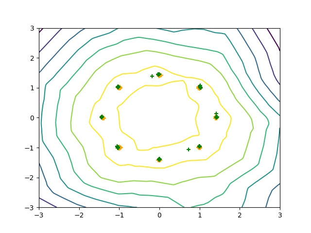
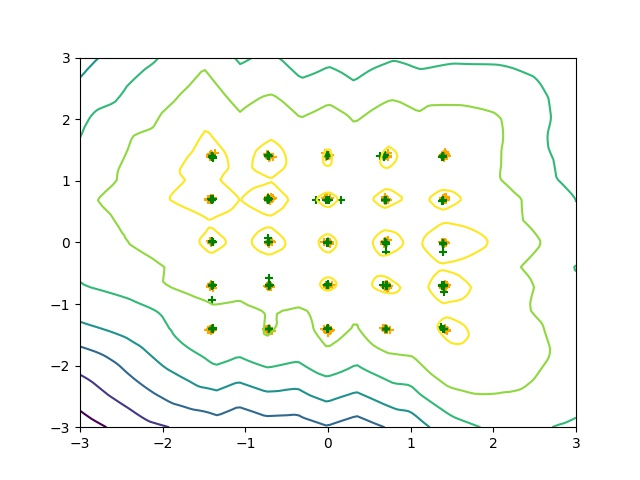
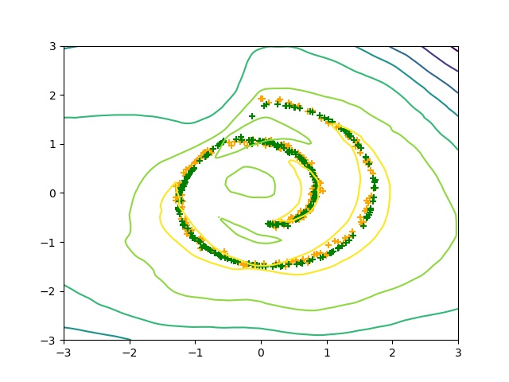
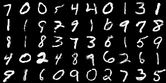
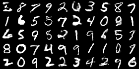
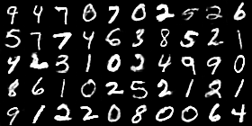

# WGAN-GP
An pytorch implementation of Paper "Improved Training of Wasserstein GANs".

# Prerequisites

Python, NumPy, SciPy, Matplotlib
A recent NVIDIA GPU

**A latest master version of Pytorch**

# Progress

- [x] gan_toy.py : Toy datasets (8 Gaussians, 25 Gaussians, Swiss Roll).(**Finished** in 2017.5.8)

- [x] gan_language.py : Character-level language model (Discriminator is using **nn.Conv1d**. Generator is using **nn.Conv1d**. **Finished** in 2017.6.23. And Results is coming soon.)

- [x] gan_mnist.py : MNIST (**Running Results while Finished** in 2017.5.11. Discriminator is using **nn.Conv1d**. Generator is using **nn.Conv1d**. And New Results is coming soon.)

- [ ] gan_64x64.py: 64x64 architectures(**Looking forward to your pull request**)

- [ ] gan_cifar.py: CIFAR-10(**Looking forward to your pull request**)

# Results

- [Toy Dataset](results/toy/)

  Some Sample Result, you can refer to the [results/toy/](results/toy/) folder for **details**.

  - **8gaussians 154500 iteration**

  

  - **25gaussians 48500 iteration**

    

  - **swissroll 69400 iteration**

  

- [Mnist Dataset](result/mnist/)

  Some Sample Result, you can refer to the [results/mnist/](results/mnist/) folder for **details**.

  

  

  

# Acknowledge

Based on the implementation [igul222/improved_wgan_training](https://github.com/igul222/improved_wgan_training) and [martinarjovsky/WassersteinGAN](https://github.com/martinarjovsky/WassersteinGAN)
