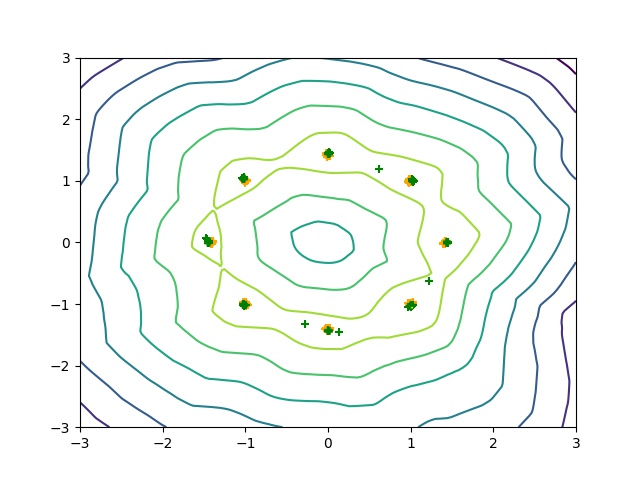

# WGAN-GP [WIP]
An pytorch implementation of Paper "Improved Training of Wasserstein GANs".

# Prerequisites

Python, NumPy, Pytorch, SciPy, Matplotlib
A recent NVIDIA GPU

# Process

- [x] gan_toy.py(**Finished** in 2017.5.8)
- [ ] gan_language.py(Working Progress)

# Results

## Toy Dataset

### **8gaussians** Dataset Training after **99799 generator iterators** 

1. Learning distribution

2. Discriminator Objective Function Curve

   

3. Generator Objective Function Curve

   