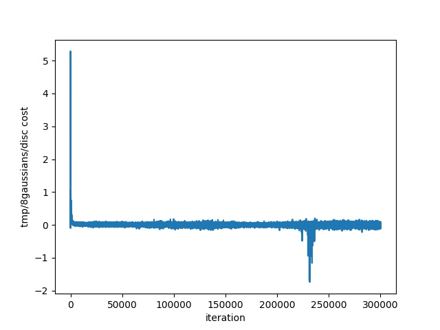
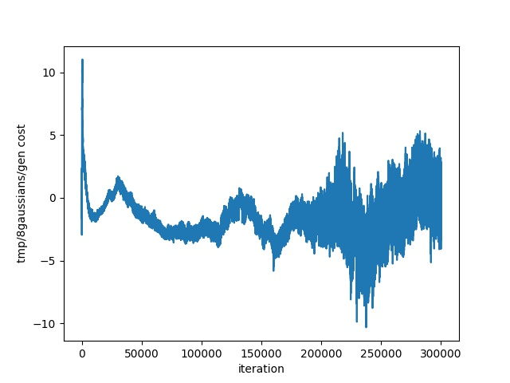

# Toy Dataset

## **8gaussians** Dataset Training 

1. Learning distribution and Discriminator Decision Boundaries

   - orange is the real data
   - green is the fake data
   - Iterations : 99799 generator iters

   

2. Discriminator Objective Function Curve

   

3. Generator Objective Function Curve

   