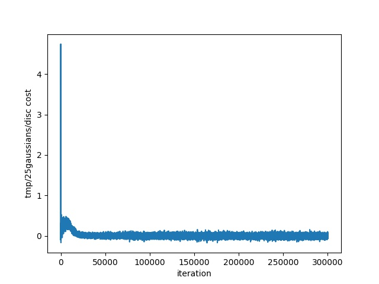
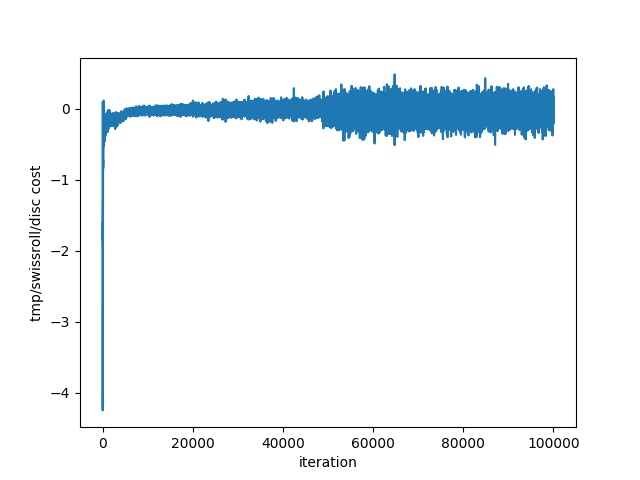
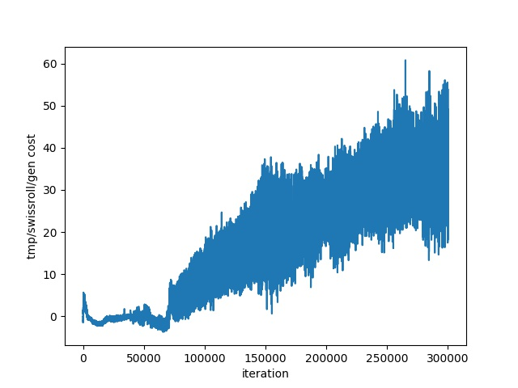

# Toy Dataset

## **8gaussians** Dataset Training 

- orange is the **real data**
- green is the **generated data**
- Total Iterations : **300000** generator iters

### Wasserstein Distance

### Discriminator Cost Function Curve

### Generator  Cost Function Curve

### A Gif for first 30000 iterations

## **25gaussians** Dataset Training

- orange is the **real data**
- green is the **generated data**
- Total Iterations : **300000** generator iters

### Discriminator  Cost Function Curve

### Generator  Cost Function Curve

### A Gif for first 30000 iterations

## **Swissroll** Dataset Training

- orange is the **real data**
- green is the **generated data**
- Total Iterations : **300000** generator iters

### Wasserstein Distance

### Discriminator  Cost Function Curve

### Generator  Cost Function Curve

### A Gif for first 30000 iterations

